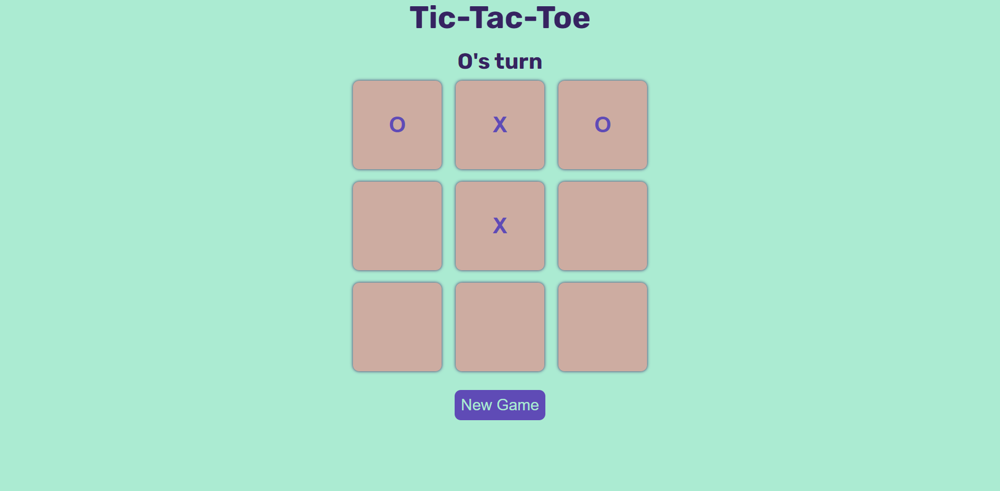

# Tic-Tac-Toe

Tic-Tac-Toe is a classic two-player game where players take turns marking spaces in a 3x3 grid with their respective symbols, usually "X" and "O". The player who succeeds in placing three of their marks in a horizontal, vertical, or diagonal row wins the game.

## Table of Contents

- [Features](#features)
- [Technologies Used](#technologies-used)
- [Setup](#setup)
- [How to Play](#how-to-play)
- [Contributing](#contributing)
- [License](#license)

## Features

- Responsive design suitable for desktop and mobile devices.
- Turn indicator displaying whose turn it is: "O" or "X".
- Winning message displaying the winner's symbol.
- Ability to start a new game after completion.
- Minimalist design with intuitive user interface.

## Technologies Used

- HTML5
- CSS3
- JavaScript

## Setup

To run this project locally, follow these steps:

1. Clone the repository:

   ```bash
   git clone https://github.com/shivain2393/Tic-Tac-Toe-mini-project.git
2. Navigate to the project directory:
    ```bash 
    cd Tic-Tac-Toe-mini-project
3. Open the `index.html` file in your preferred web browser.

## How to Play

1. Open the game in your web browser.
2. Click on any empty box to make your move.
3. Players take turns marking spaces until one player wins or the game ends in a draw.
4. If one player gets three of their symbols in a row, column, or diagonal, they win the game.
5. If all spaces are filled and no player has won, the game ends in a draw.

## Screenshots





## Contributing

Contributions are welcome! If you'd like to contribute to this project, feel free to open an issue or submit a pull request.

## License

This project is licensed under the MIT License.
